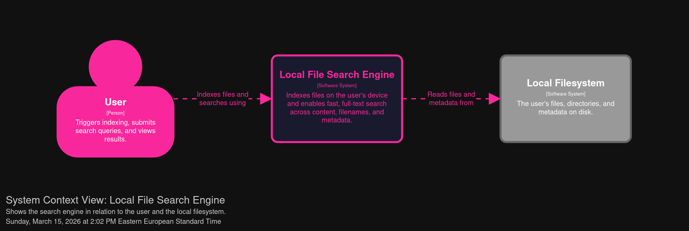
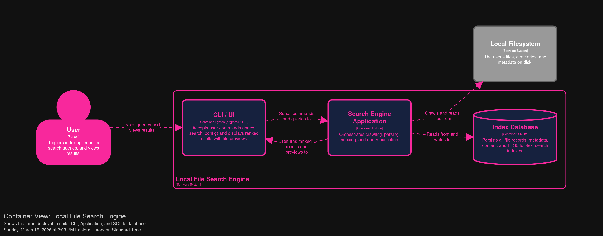
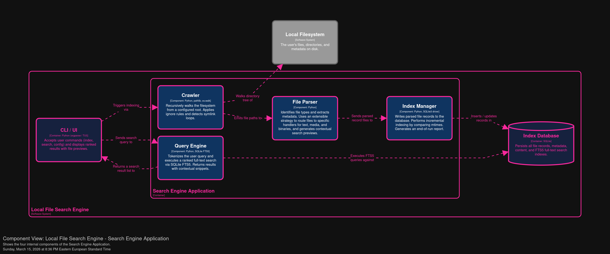

# Local File Search Engine: Architecture

This document outlines the software architecture for the Local File Search Engine using Simon Brown's C4 model. The goal of this design is to define the various boundaries between our system's containers, components, and modules so that when new requirements arise in future iterations, the cost of change is minimized.

## 1. System Context (Level 1)

The system context represents the top level representing the entire system and how it interacts with the world.

* **User:** Triggers the indexing process, submits search queries, and views the ranked results.
* **Local File Search Engine (Local System):** A local system that indexes files on the device, including documents, media, and binaries.It enables fast, full-text search across content, filenames, and metadata. 
* **Local Filesystem (External System):** The user's underlying hard drive and OS directory structure. The engine crawls this to filter out unwanted data and extract information.

## 2. Containers (Level 2)

Containers represent the deployable units that make up the search engine. 

* **CLI / UI:** The interface that accepts user commands (e.g., index, search, config) and displays ranked results with contextual file previews. 
* **Search Engine Application:** The core application that orchestrates crawling, parsing, indexing, and query execution. 
* **Index Database (SQLite):** The SQLite DBMS used to store the parsed data and metadata, offloading the complexity of designing a custom indexing format. 

## 3. Components (Level 3)

Components are the major structural building blocks in code. The **Search Engine Application** container comprises the following components:

* **Crawler:** Recursively walks the filesystem from a configured root. It handles edge cases gracefully, such as detecting and avoiding symlink loops.
* **File Parser:** The File Parser identifies file types using MIME types or file extensions and extracts standard metadata such as file size and timestamps to keep for future use cases. It utilizes an extensible parsing strategy to route files to format-specific handlers for text, media, and binaries. Additionally, it generates contextual search previews appropriate for the specific file type, like extracting the first three lines of a textual document.
* **Index Manager:** Writes parsed file records to the database. It performs incremental indexing by detecting file changes (e.g., comparing modification times) and updating only modified records. It also generates a progress report at the end of its run.
* **Query Engine:** Tokenizes user queries and executes them against the database. It handles both single-word and multi-word searches to return fast and responsive results using SQLite FTS5 full-text search.

## 4. Code (Level 4)
Each component comprises a number of classes that contain a set of low-level methods or functions. 
* This will be fullfiled as the development of the Project progresses and the actual codebase it is built.

